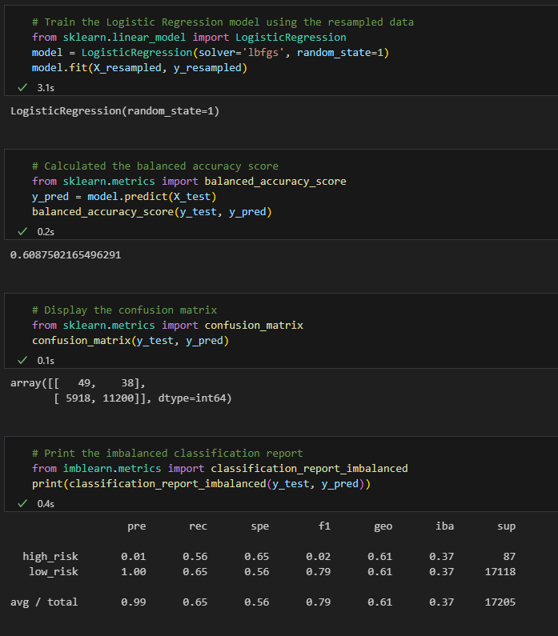
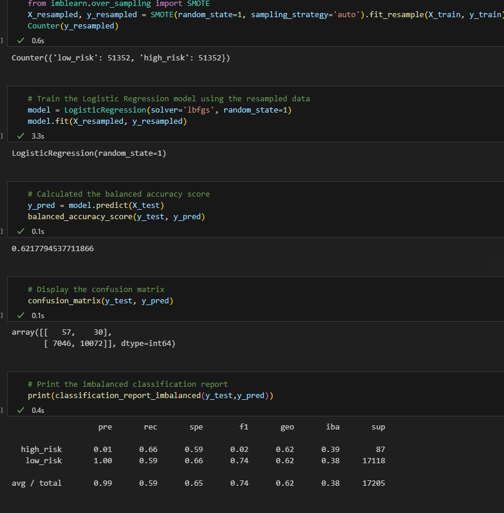
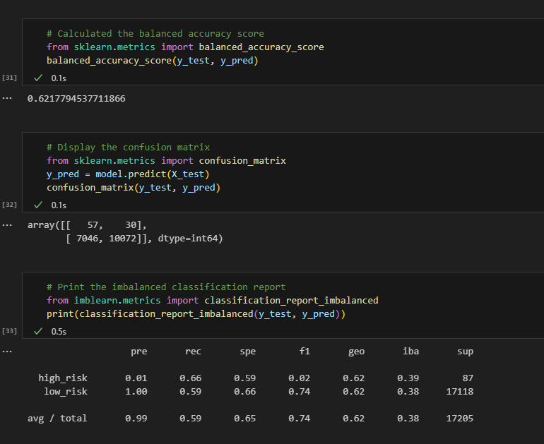
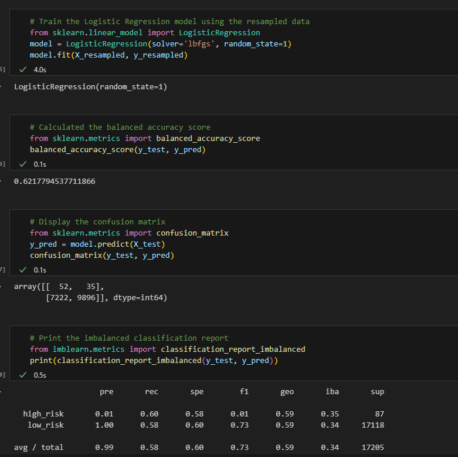
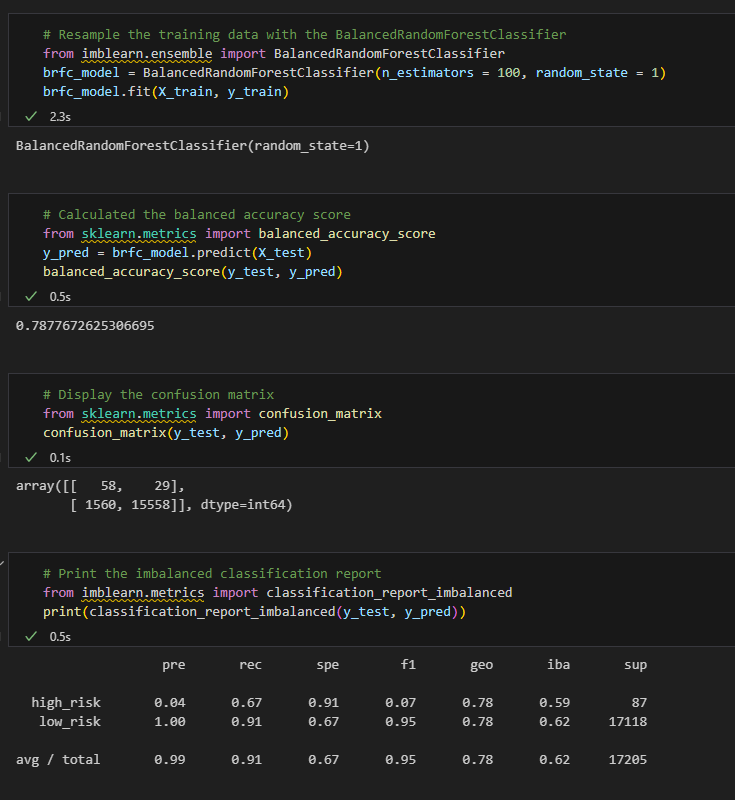
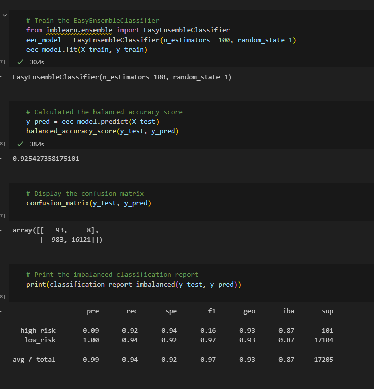

# Credit_Risk_Analysis

In this module we will use supervised machine learning models to determine how well we can predict levels of loan risk. Using confusion matrices, balanced accuracy scores and imblanced classification reports we will determine which model fits the best to the task of predicting credit risk.

# Machine Learning Models

## Native Random Oversampling
Using native random oversampling produced the following results:

The balanced accuracy score was ~0.60875.
The precision score for High-risk loans is low, while the opposite is true for Low-risk loans
And the recall for High Risk loans is .56, and Low Risk loans is .65

## SMOTE Oversampling
Using a the SMOTE oversampling model produced the following results:

The balanced accuracy score was ~0.62178.
The precision score for High-risk loans is low, while the opposite is true for Low-risk loans
And the recall for High Risk loans is .66, and Low Risk loans is .59

## Undersampling
Using undersampling produced the following results:

The balanced accuracy score was ~0.62178.
The precision score for High-risk loans is low, while the opposite is true for Low-risk loans
And the recall for High Risk loans is .66, and Low Risk loans is .59
*These results were incredible similar to the SMOTE Oversampling, which may indicate incorrect results.

## Combination Under-Oversampling
Using a combination model of under and oversampling produced the following results:

The balanced accuracy score was ~0.62178.
The precision score for High-risk loans is low, while the opposite is true for Low-risk loans
And the recall for High Risk loans is .60, and Low Risk loans is .58
*While similar in accuracy the confusion matrix and classification report suggest these results are valid.

## Balanced Random Forest Classifier
By using the Balanced Random Forest Classifier we were able to obtain the following stats:

The balanced accuracy score was ~0.78777.
The precision score for High-risk loans is still low at 0.04, while the opposite is true for Low-risk loans, as it is a 1.00
And the recall for High Risk loans is .67, and Low Risk loans is .91

## Easy Ensemble AdaBoost Classifier
With the Easy Ensemble AdaBoost Classifier we were able to obtain our best results yet.

The balanced accuracy score was ~0.92543.
The precision score for High-risk loans still low at 0.09, while the opposite is true for Low-risk loans at a 1.00
And the recall for High Risk loans is .92, and Low Risk loans is .94

### Conclusion
It is clear in every category that the Easy Ensemble AdaBoost Classifier is the best model to fit to this data set. It has the highest accuracy, precision score for High-risk and Low-risk loans, and very high recallability. One thing that becomes clear is that High-risk loans are very difficult to predict the status of. Whether this is because the sample is much lower, due to banks hesitance to give out high risk loans, or simple because they are naturally less predicatable is not clear. Using a larger dataset with more instances of high risk loans could be fruitful. As it stands, this model works wonderfully for the prediction of low-risk loan outcomes. 
